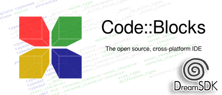

# Code::Blocks 20.03 for DreamSDK

[Code::Blocks](http://www.codeblocks.org/) is a free, open-source cross-platform IDE that supports various compilers.

[DreamSDK](https://dreamsdk.org "DreamSDK") is a modern, ready-to-use environment for the [Sega Dreamcast](https://en.wikipedia.org/wiki/Dreamcast) development, designed for the **Microsoft Windows** platform. It's a package composed by a lot of pre-compiled tools; and Code::Blocks is a nice IDE which unleash the power of **DreamSDK**.

This repository hold a special version of the official **Code::Blocks 20.03** stable release modified for adding full support of [DreamSDK](https://dreamsdk.org "DreamSDK"). 

Notables changes of this special release of **Code::Blocks** includes:

* New compiler/options file (`dc-gcc`) which specify the `GNU GCC Compiler for Sega Dreamcast` compiler.
* The `compiler` and `debugger` plugins have been patched to run the loader (i.e. `dc-tool`) before running the target.
* The `Sega Dreamcast Project` (`dc`) wizard template has been added.

## Introduction

This repository will allow you to build [Code::Blocks 20.03](https://www.codeblocks.org "Code::Blocks") for embedding it in the [Code::Blocks Patcher for DreamSDK](https://github.com/dreamsdk/codeblocks-patcher) binary.

Code::Blocks 20.03 is available in both 32-bits and 64-bits. You will need to build both versions from this source. The 32-bits release should support Windows XP, as DreamSDK is targeting from Windows XP to Windows 11. For that, you will need to use specific versions of libraries/compilers, some of them are provided in this repository.

By the way, the official Code::Blocks 20.03 32-bits release is not supporting Windows XP, which is the case of Code::Blocks for DreamSDK.

## Prerequisites

Install all the prerequisites below before trying to work with this repository.

These **are** provided directly in this repository, under the `tools` directory:

* [TDM-GCC-64 9.2.0](https://jmeubank.github.io/tdm-gcc/) for 32-bits release (**yes this is normal**) and [Nuwen 16.1](https://nuwen.net/mingw.html) for 64-bits release.
* [Zip 3.00 from Info-ZIP](http://infozip.sourceforge.net/ "Info-ZIP"). 
* [Ultimate Packer for eXecutables](https://upx.github.io/ "UPX") (UPX).

These **are not** provided in this repository but could be easily downloaded:

* [Code::Blocks](https://www.codeblocks.org) (**yes, for building Code::Blocks... you'll need Code::Blocks**).
* [Boost 1.64.0](https://www.boost.org/users/history/version_1_64_0.html) for 32-bits release and [Boost 1.74.0](https://www.boost.org/users/history/version_1_74_0.html) for 64-bits release.
* [7-Zip](http://www.7-zip.org).
 
## Installing Boost

### 32-bits release (x86)

The last version of the **Boost** libraries supporting **Windows XP** is the `1.64.0` version. After that version, Windows XP is unsupported. To keep the XP support you must use that specific version.

1. Unzip [boost 1.64.0](https://dl.bintray.com/boostorg/release/1.64.0/source/boost_1_64_0.7z).
2. Open the [TDM-GCC-32](http://tdm-gcc.tdragon.net) prompt.
3. Enter the following commands:

		cd /D <path>\boost_1_64_0
		bootstrap gcc
		b2 --toolset=gcc "--prefix=C:\Program Files\CodeBlocks" install

For your information, the official Code::Blocks 20.03 32-bits release is not supporting Windows XP due to an incompatible [Dr. MinGW](https://github.com/jrfonseca/drmingw "Dr. MinGW") component version, but this special release will support that.

### 64-bits release (x64)

... TODO ...

## Configuring Code::Blocks IDE

To build **Code::Blocks** you will need... **Code::Blocks**. Install the IDE and both toolchains if not already done.

1. Start **Code::Blocks** then open the `.\codeblocks\codeblocks\src\CodeBlocks.workspace` file. This will open the `Code::Blocks wx2.8.x` workspace.
2. Select the **Settings** > **Global Variable** menu item then select (or create) the `boost` variable. In the `base` directory field, enter `C:\Program Files\CodeBlocks`. In the `include` field, enter `C:\Program Files\CodeBlocks\include\boost-1_64` then in the `lib` field, enter `C:\Program Files\CodeBlocks\lib`.
4. Select (or create) the `cb_release_type` variable and enter `-g -O0` in the `base` field.
5. Select (or create) the `wx` variable, enter `./wxMSW` (e.g. `C:\codeblocks\wxMSW`) in the `base` field. Please use the provided `wxMSW` directory provided in that repository.

## Debugging your Code::Blocks build

If you want to debug the **Code::Blocks** build, select the `src` target and install a **DreamSDK** working package in `E:\DreamSDK\`.
If you don't have an `E:` drive, you have to do some modifications:

1. Change the `DREAMSDK_HOME_DEBUG_DRIVE` variable in `.\packager\mkpkg.cmd`.
2. Change the `E:` drive reference in the two files below:

	- `.\codeblocks\src\plugins\compilergcc\resources\compilers\compiler_dc-gcc.xml`
	- `.\codeblocks\src\plugins\compilergcc\resources\compilers\options_dc-gcc.xml`

3. In the debugged **Code::Blocks**, go to the **Settings** > **Compiler** menu, 
select the **GNU GCC Compiler for Sega Dreamcast** profile and click on **Reset defaults**.
**Code::Blocks** should detect the **DreamSDK** package environment used for debug your **Code::Blocks** build.
4. The GNU Debugger (GDB) included in the latest release of **TDM-GCC** is buggy: some breakpoints are never reached. You should use a newer GNU Debugger (GDB) binary, for example the one included in **DreamSDK** (i.e. `E:\DreamSDK\bin\gdb.exe`). To change that, you may update the Debugger profile inside Code::Blocks (in the `Settings` menu).

## Building a Code::Blocks release

for 64 check than Nuwen is defined for GCC Compiler

1. Make your changes in the **Code:Blocks** source (basically in `sdk`, `Compiler` and `Debugger` targets).
2. Select the **Settings** > **Global Variable** menu item then select the `cb_release_type` variable and enter `-O2` in the `base` field.
3. Change the content of the `.\codeblocks\src\include\autorevision.h` file. In normal conditions, this file is created automatically when using **SVN** and the `autorevision` tool. Or you may just create this `autorevision.h` file manually. The SVN revision `11256` is the official revision for the `17.12` release.

		/*0*/
		//don't include this header, only configmanager-revision.cpp should do this.
		#ifndef AUTOREVISION_H
		#define AUTOREVISION_H
	
	
		#include <wx/string.h>
	
		namespace autorevision
		{
			const unsigned int svn_revision = 11256;
			const wxString svnRevision(_T("11256"));
			const wxString svnDate(_T("YYYY-MM-DD hh:mm:ss")); // update manually the date/time using this format
		}
	
	
	
		#endif

4. Rebuild the [the whole workspace](http://wiki.codeblocks.org/index.php/Installing_Code::Blocks_from_source_on_Windows).
5. Run the `.\codeblocks\src\update.bat` file.

## Making the package

After building the **Code::Blocks** release, you need to build the package that will be embedded in the **Code::Blocks Patcher for DreamSDK**.

1. Build Code::Blocks in Release mode (i.e. `cb_release_type` variable should be `-O2`) and run the `.\codeblocks\src\update.bat` file.
2. Go to the `.\packager` directory.
3. From there, run the `mkpkg.cmd` file.
4. Build the `.\cbpatcher\src\splash\codeblocks-splash.lpi` in **Release** mode from **Lazarus**, then pack the `.\cbpatcher\src\engine\embedded\codeblocks-splash.exe` file with **UPX**.
5. Build the `.\cbpatcher\src\codeblocks-patcher.lpi` in **Release** mode from **Lazarus**. No need to pack this with **UPX**.
6. Done! You should have now the `codeblocks-patcher.exe` file which can be embedded in the **DreamSDK Setup** file. Don't be surprised, it's a big file around `10MB`.

**Note:** a new `sdk` (`codeblocks.dll`) module is needed to expose the required `CallHooks()` function in the *Squirrel* script, that's why almost all compiled binaries are provided in the generated patch.

## FAQ

### Unable to debug the compiled Code::Blocks? ###

Sometimes, the breakpoints are never reached while compiling with **TDM-GCC-32** including **GCC 5.1.0**.

Please verify the following:

* The `cb_release_type` global variable should be set to `-g -O0` in order to activate debug symbols.
* Sometimes the **GDB** version included in **TDM-GCC-32** is buggy. Try to use another **GDB** build (like the one included in **DreamSDK** itself).

### The message 'Mismatch between the program and library build versions detected.' is displayed ###
 
When you rebuild the whole **Code::Blocks** workspace, the following message may be displayed:

	Fatal Error: Mismatch between the program and library build versions detected.
	The library used 2.8 (wchar_t,compiler with C++ ABI 1008,STL containers,compatible with 2.8),
	and your program used 2.8 (wchar_t,compiler with C++ ABI 1002,STL containers,compatible with 2.8).

The only difference is the C++ ABI version i.e. `1008` vs. `1002`.

After some investigation, the problem arises from the fact that **Code::Blocks** was compiled with **gcc 5.1.0**, which defines `__GXX_ABI_VERSION` as `1008`, but the pre-compiled wxWidgets library was made with **clang 3.6**, which defines `__GXX_ABI_VERSION` as `1002` ([See reference](https://groups.google.com/forum/#!topic/wx-users/bzXESX__828)).

To solve this issue, you may need to recompile the provided `wxMSW` library ([wxWidgets](https://www.wxwidgets.org/)):

1. Open the **TDM-GCC-32** command prompt from the `Start` menu.
2. Type `cd .\wxMSW\build\msw` then `mingw32-make -f makefile.gcc MONOLITHIC=1 SHARED=1 UNICODE=1 BUILD=release VENDOR=cb CXXFLAGS=-fpermissive` ([Read more](https://wiki.wxwidgets.org/WxWidgets_Build_Configurations)). This should update the `.\wxMSW\lib\gcc_dll\wxmsw28u_gcc_cb.dll` file.
3. Copy the updated `.\wxMSW\lib\gcc_dll\wxmsw28u_gcc_cb.dll` file to `.\codeblocks\src\devel\` (this is important!).
3. Rebuild the **Code::Blocks** source.
4. Try again.

**Note:** You may need to enable debugging for **wxWidgets**, in this case you should just set the `BUILD` parameter to `debug` (i.e. `BUILD=debug`). Do this if you want to debug the wxWidgets library. 

### Couldn't add an image to the image list. ###

This message is sometimes shown when starting the debug build of **Code::Blocks**. It caused by missing image files in the `.\codeblocks\src\devel\share\CodeBlocks\images\` directory.

To solve this issue, you just have to run the `.\codeblocks\src\update.bat` file, this will copy the missing files to the `devel` and `output` directories.
