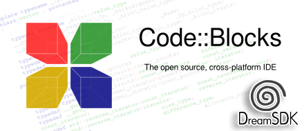
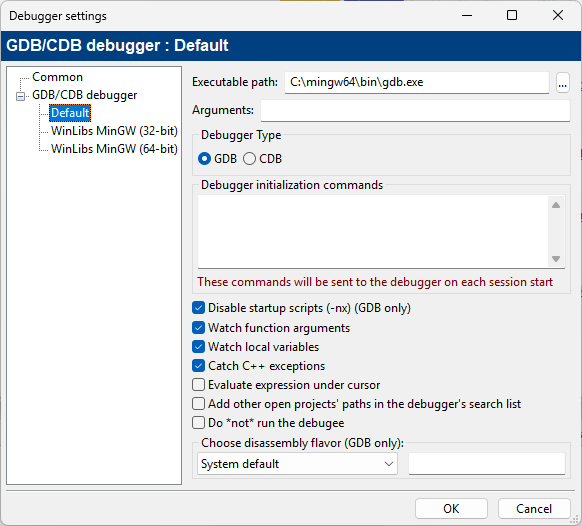
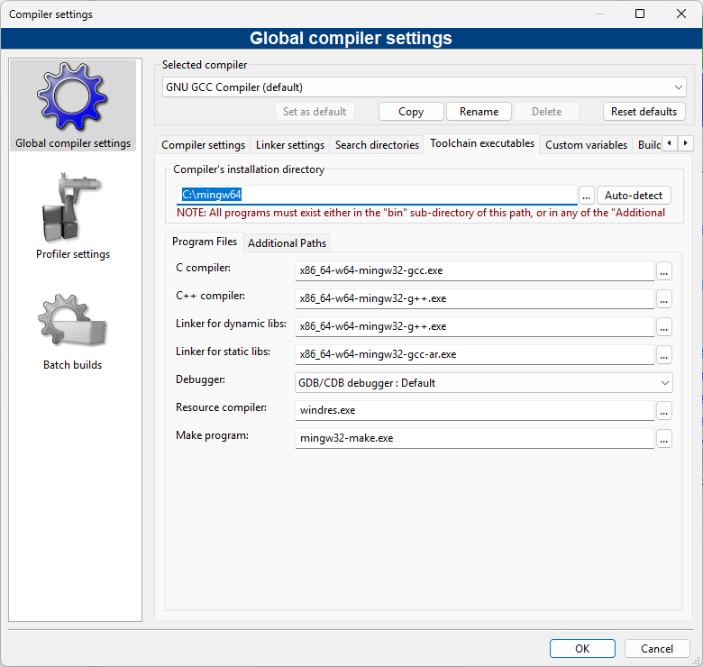
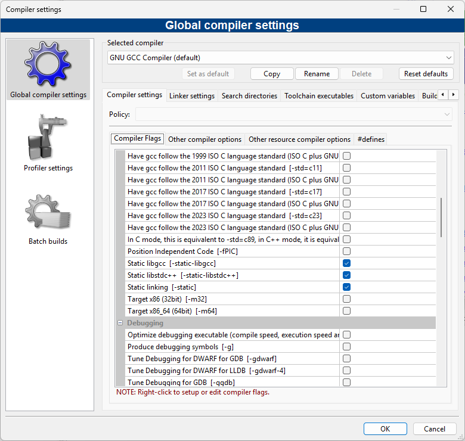
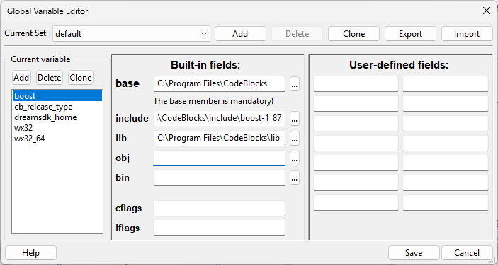
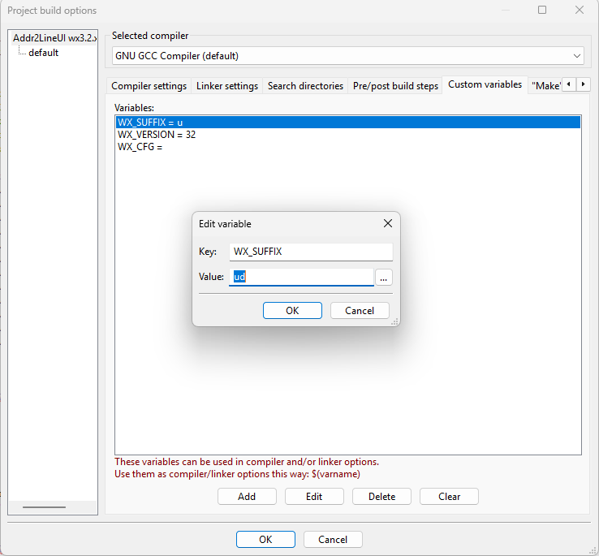
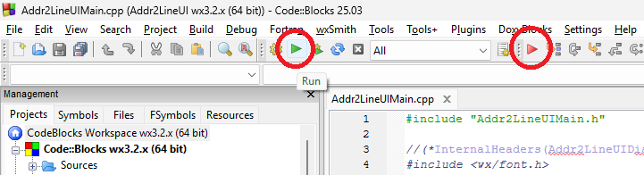

# Code::Blocks 25.03 for DreamSDK

[Code::Blocks](http://www.codeblocks.org/) is a free, open-source cross-platform IDE that supports various compilers.

[DreamSDK](https://dreamsdk.org "DreamSDK") is a modern, ready-to-use environment for the [Sega Dreamcast](https://en.wikipedia.org/wiki/Dreamcast) development, designed for the **Microsoft Windows** platform. It's a package composed by a lot of pre-compiled tools; and Code::Blocks is a nice IDE which unleash the power of **DreamSDK**.

**This repository hold a special edition of the official Code::Blocks 25.03 stable release modified for adding full support of DreamSDK.**

If you are interested about Code::Blocks but not in Sega Dreamcast development using DreamSDK, you may use the official Code::Blocks release then. But if you are interested in Sega Dreamcast development using DreamSDK, and at the same time, you are interested in regular development, you can use this special edition of Code::Blocks without any issue, as the changes performed in this fork are not destructive, they only applies in DreamSDK profile.

Notables changes of this special edition of **Code::Blocks** includes:

* New compiler/options file (`dc-gcc`) which specify the `GNU GCC Compiler for Sega Dreamcast` compiler.
* The `compiler` and `debugger` plugins have been patched to run the loader (i.e. `dc-tool`) before running the target.
* The `Sega Dreamcast Project` (`dc`) wizard template has been added.

The changes are located in the **Code:Blocks** source in the `sdk`, `Compiler` and `Debugger` projects.
The new `sdk` (`codeblocks.dll`) module is needed to expose the required `CallHooks()` function in the *Squirrel* script (used to refresh the IDE while using the `dc` profile), that's why almost all compiled binaries are provided in the generated patch.

## Introduction

This repository will allow you to build [Code::Blocks 25.03](https://www.codeblocks.org "Code::Blocks") for embedding it in the [Code::Blocks Patcher for DreamSDK](https://github.com/dreamsdk/codeblocks-patcher).

Code::Blocks 25.03 is available in both 32-bits and 64-bits. You will need to build both versions from the same source.
Unlike Code::Blocks 17.12 or 20.03, Code::Blocks 25.03 does not support Windows XP: it only works with Windows 10 and later.

In summary, the goal of this repository is to generate the following packages: 
- `.\packager\dist\codeblocks-25.03-dreamsdk-addon-bin-x86.7z` for 32-bit;
- `.\packager\dist\codeblocks-25.03-dreamsdk-addon-bin-x64.7z` for 64-bit.

These packages will be embedded in the **Code::Blocks Patcher for DreamSDK** (`codeblocks-patcher.exe`).
This patcher is available in the [Code::Blocks Patcher for DreamSDK](https://github.com/dreamsdk/codeblocks-patcher) repository.

This documents assumes that you're using a 64-bit Windows. 64-bit Windows can build 32-bit binaries as well.

## Prerequisites

This section contains instructions to follow after the initial cloning is complete. 
Install all the prerequisites below before trying to work with this repository. Some are provided for convenience while others must be downloaded manually.

These **are** provided directly in this repository, under the `tools` directory:

- [GCC 14.2.0 (with POSIX threads) + LLVM/Clang/LLD/LLDB 19.1.7 + MinGW-w64 12.0.0 UCRT from WinLibs](https://winlibs.com/ "WinLibs")
- [Zip 3.00 from Info-ZIP](http://infozip.sourceforge.net/ "Info-ZIP").
- [Ultimate Packer for eXecutables](https://upx.github.io/ "UPX") (UPX).

These **are not** provided in this repository but could be easily downloaded:

- [7-Zip](http://www.7-zip.org).
- [Boost 1.87.0](http://www.boost.org/users/history/version_1_87_0.html).
- [Code::Blocks](https://www.codeblocks.org) (**yes, for building Code::Blocks you will need Code::Blocks**).
- [DreamSDK](https://www.dreamsdk.org) (this is not required for building Code::Blocks but will be for testing the special edition that we will build using this repository).

### Install WinLibs toolchains

Just unzip the 2 WinLibs toolchains in the drive root, usually `C:\`:
- 64-bit will be unzipped in `C:\mingw64`
- 32-bit will be unzipped in `C:\mingw32`

### Install other prerequisites

1. Make sure `zip` and `upx` are available in your `PATH` variable.
2. Install [7-Zip](http://www.7-zip.org) using the default settings and make sure `7z` is available in your `PATH` variable.
3. Download [Code::Blocks](https://www.codeblocks.org) without the embedded compiler, as we will use our own (i.e., `codeblocks-25.03-setup.exe` for 64-bit or `codeblocks-25.03-32bit-setup.exe` for 32-bit). Install it with the default settings.
4. Install [DreamSDK](https://www.dreamsdk.org) using the default settings (i.e., it needs to be installed in `C:\DreamSDK`).

### Building wxMSW

After installing all the prerequisites, you need to build **wxWidgets for Windows**, i.e. **wxMSW**. You only need to do that once; fortunately because this process is really very long.

1. Copy the `.\wxMSW\build.template.ini` and name it `build.ini`.
2. Open the `.\wxMSW\build.ini` file and adapt it as needed.
3. Double-click on the `.\wxMSW\build.cmd` file.

The `.\wxMSW\bin` directory will be created, that will contains both `debug` and `release` wxWidgets for Windows builds, both on 32-bit and 64-bit flavours.

### Installing Boost

Boost is used for some plugins in Code::Blocks, for example for the [Nassi–Shneiderman](https://wiki.codeblocks.org/index.php/NassiShneiderman_plugin) plugin.

This section explains how to install Boost for Code::Blocks.

1. Unzip [boost 1.87.0](http://www.boost.org/users/history/version_1_87_0.html). The location where Boost is unzipped is called officially `$BOOST_ROOT`. Usually, `$BOOST_ROOT` will be set as `C:\Program Files\boost\boost_1_87_0`, but it could be `C:\boost_1_87_0` or whatever you want.
2. Open a Windows Command prompt.
3. Enter the following commands:

		set WINLIBS_ROOT=C:\mingw64
		set CODEBLOCKS_ROOT=C:\Program Files\CodeBlocks
		set BOOST_ROOT=C:\Program Files\boost\boost_1_87_0
		set PATH=%WINLIBS_ROOT%\bin\;%PATH%
		cd /D %BOOST_ROOT%
		bootstrap gcc
		b2 install --toolset=gcc "--prefix=%CODEBLOCKS_ROOT%" boost.stacktrace.from_exception=off

After running those commands, Boost is indeed installed. If using a 64-bit Windows, it will be installed for both 64-bit and 32-bit (as using the WinLibs 64-bit toolchain allow to build both CPU architectures), and of course if you compiled under a 32-bit Windows, only 32-bit has been built. Now we need to configure Code::Blocks IDE, as explained below.

### Configuring Code::Blocks IDE

To build **Code::Blocks** you will indeed need **Code::Blocks**.
Install the IDE without the embedded MinGW compiler (as it isn't needed) then unzip both WinLibs toolchains if not already done (see above). Now, it's necessary to configure Debuggers and Compilers in Code::Blocks.

As always, this section assumes that you are setting up things on 64-bit Windows, but adjust the settings if necessary.

#### Configure Debuggers in Code::Blocks

1. Select the **Settings** > **Debugger** menu item in Code::Blocks.
2. Click on **GDB/CDB debugger** then **Default**.
3. In **Executable path**, input the correct GNU Debugger (GDB) binary: `C:\mingw64\bin\gdb.exe`
4. Select the **GDB/CDG debugger** then click on **Create config**. Enter the name `Default (32-bit)` and click **OK**.
5. In **Executable path**, input: `C:\mingw32\bin\gdb.exe`.
4. Click **OK** to close the **Debugger settings** window.

Result:

**Note:** [This part has been written using the WinLibs official guide as base](https://winlibs.com/#usage-codeblocks).

#### Configure Compilers in Code::Blocks

The Code::Blocks project is expecting to use the `GNU GCC Compiler` profile for 64-bit project, while the `GNU GCC Compiler (32-bit)` profile would be used for 32-bit Windows.
Please note, the `GNU GCC Compiler (32-bit)` is not the official compiler expected by the Code::Blocks 32-bit source, but it make things easier as we can build both 64-bit and 32-bit Code::Blocks binaries on a single machine like this.

Let's configure the 64-bit profile, `GNU GCC Compiler`:
1. Select the **Settings** > **Compiler** menu item in Code::Blocks.
2. Select the **GNU GCC Compiler (default)** profile in the list if not already done.
3. Click on **Toolchain executables** and input `C:\mingw64` in **Compiler's installation directory**.
4. In the **Program files** sub-tab, input the following:
    - **C compiler:** `x86_64-w64-mingw32-gcc.exe`
    - **C++ compiler:** `x86_64-w64-mingw32-g++.exe`
    - **Linker for dynamic libraries:** `x86_64-w64-mingw32-g++.exe`
    - **Linker for static libraries:** `x86_64-w64-mingw32-gcc-ar.exe`
    - **Debugger:** Select `GDB/CDB debugger: Default` as configured before
    - **Resource compiler:** This won't be used but you can set `windres.exe` here
    - **Make program:** `mingw32-make.exe`

Result:

Then, select the options forcing the build of static binaries. If not doing so, you will be forced to redistribute MinGW-w64 runtime libraries (DLL), something that we don't want for Code::Blocks.

5. Click on **Compiler settings** tab.
6. The General section should be displayed. Scroll down in the window, then tick the following boxes:
    - `Static libgcc [-static-libgcc]`
	- `Static libstdc++ [-static-libstdc++]`
	- `Static linking [-static]`
	
Result:

Now it's time to create the 32-bit profile, named `GNU GCC Compiler (32-bit)`:
7. In the **Selected compiler**, make sure to select the `GNU GCC Compiler` we just configured earlier.
8. Click on **Copy**. In the box, enter the following name by replacing the `Copy of GNU GCC Compiler` by `GNU GCC Compiler (32-bit)`. Click on **OK**. Validate the warning displayed now.
9. Go to **Toolchain executables** and change the **Compiler's installation directory**: `C:\mingw32`.
10. In the **Program files** sub-tab:
    - Change the executables prefixes: `x86_64` needs to be replaced by `i686` (i.e., `x86_64-w64-mingw32-gcc.exe` becomes `i686-w64-mingw32-gcc.exe`).
    - **Debugger**: Select `GDB/CDB debugger: Default (32-bit)`
    - You don't have to update **Resource compiler** and **Make program**.    	

You can now validate the **Compiler settings** dialog by clicking **OK**.

#### Global Variables configuration

After making this configuration, you can open the Code::Blocks IDE project in Code::Blocks.

Start **Code::Blocks** then open the `.\codeblocks\codeblocks\src\CodeBlocks_wx32_64.workspace` file for 64-bit build or the `CodeBlocks_wx32.workspace` file for 32-bit build.

As always in this document, we will consider that you want to build the 64-bit release, so we will open the `CodeBlocks_wx32_64.workspace` file. This will open the `CodeBlocks Workspace wx3.2.x (64 bit)` workspace in your Code::Blocks IDE.

The **Global Variables** window should be shown automatically, if not, select the **Settings** > **Global Variables** menu item in Code::Blocks. Select (or create) the following variables:
- For the `wx32_64` variable (`wx32` for 32-bit release):
    - In the `base` field, enter `${root}\wxMSW\bin\${arch}\release`, where `${root}` is the directory path where this repository is stored and `${arch}` will be `x86` or `x64` (e.g. `C:\codeblocks\wxMSW\bin\x64\release` if you cloned this in `C:\codeblocks`).
	- In the `include` field, enter `${root}\wxMSW\bin\${arch}\release\include` (e.g., `C:\codeblocks-25.03\wxMSW\bin\x64\release\include`)
	- In the `lib` field, enter `${root}\wxMSW\bin\${arch}\release\lib` (e.g., `C:\codeblocks-25.03\wxMSW\bin\x64\release\lib`)
	- In the `bin` field, enter `${root}\wxMSW\bin\${arch}\release\bin` (e.g., `C:\codeblocks-25.03\wxMSW\bin\x64\release\bin`)
- For the `cb_release_type` variable, enter `-g -O0` in the `base` field. This means that we will first build a Code::Blocks Debug build (see below).
- For the `boost` variable:
	- In the `base` directory field, enter `C:\Program Files\CodeBlocks`.
	- In the `include` field, enter `C:\Program Files\CodeBlocks\include\boost-1_87`.
	- In the `lib` field, enter `C:\Program Files\CodeBlocks\lib`.

Here is an example of the **Global Variables** window filled in:

**Note regarding wx32_64**: In practice, we will use only the `release` build of wxMSW, as we won't debug wxMSW itself. But if for some reasons, you want to use the Debug builds of wxMSW, then input `${root}\wxMSW\bin\${arch}\debug` in `base` field (and do the adaptations for the rest). You will need to update the `WX_SUFFIX` project variable in all projects using wxMSW:
1. Click on **Project** > **Build options...**.
2. Click on the **Custom Variables** tab.
3. In the **Variables** list, select the `WX_SUFFIX` variable and click on **Edit**.
4. In the **Value** field, input `ud` (for Unicode/Debug).

5. Validate everything by clicking **OK**.

This `WX_SUFFIX` variable need to be updated on all projects using wxMSW, so it could be really long to update.

## Debug build

You can now try to build Code::Blocks IDE in Debug mode.

Again, this part of the document assumes that 64-bit Code::Blocks will be built under WinLibs MinGW 64-bit toolchain.

### Making a Code::Blocks debug build

1. Open the `.\codeblocks\codeblocks\src\CodeBlocks_wx32_64.workspace` if not already done.
2. Select the **Settings** > **Global Variables** menu item, select the `cb_release_type` variable and enter `-g -O0` in the `base` field, if not already done.
3. Rebuild the [the whole workspace](http://wiki.codeblocks.org/index.php/Installing_Code::Blocks_from_source_on_Windows). Basically, you may right-click in the `CodeBlocks Workspace wx3.2.x (64 bit)` root node and select **Rebuild workspace**.
4. The debug build is stored in `.\codeblocks\src\devel32_64`. 

You will have to check and copy the wxMSW libraries now if not already done, but this will be done only once (or as soon as you have to rebuild wxMSW for some reason). From the `.\wxMSW\bin` appropriate directory, copy the `wxmsw32u_gcc_custom.dll` and `wxmsw32u_gl_gcc_custom.dll` files in the `.\codeblocks\src\devel32_64` directory if they aren't copied already. If you are using Debug release of wxMSW, then of course you will copy the `wxmsw32ud_gcc_custom.dll` and `wxmsw32ud_gl_gcc_custom.dll` files instead.

### Running and debugging your Code::Blocks build

If you want to debug the **Code::Blocks** build, you must first install a **DreamSDK** working package in `C:\DreamSDK\`. If you don't have an `C:` drive (really?!), you have to do some changes:

1. Change the `C:` drive reference in the 2 files below:
	- `.\codeblocks\src\plugins\compilergcc\resources\compilers\compiler_dc-gcc.xml`
	- `.\codeblocks\src\plugins\compilergcc\resources\compilers\options_dc-gcc.xml`
2. You can now run/debug the produced Code::Blocks IDE by using the left or right arrows in the toolbar.

3. In the debugged **Code::Blocks** (and NOT your regular Code::Blocks you used to build this special edition!), go to the **Settings** > **Compiler** menu, 
select the **GNU GCC Compiler for Sega Dreamcast** profile and click on **Reset defaults**.
**Code::Blocks** should detect the **DreamSDK** package environment used for debug your **Code::Blocks** build.

## Release build

### Making a Code::Blocks release build

1. Open the `.\codeblocks\codeblocks\src\CodeBlocks_wx32_64.workspace` if not already done.
2. Select the **Settings** > **Global Variables** menu item then select the `cb_release_type` variable and enter `-O2` in the `base` field.
3. Change the content of the `.\codeblocks\src\include\autorevision.h` file. In normal conditions, this file is created automatically when using **SVN** and the `autorevision` tool. Or you may just create this `autorevision.h` file manually. The SVN revision `13644` is the official revision for the `25.03` release.

		/*13644*/
		//don't include this header, only configmanager-revision.cpp should do this.
		#ifndef AUTOREVISION_H
		#define AUTOREVISION_H
	
	
		#include <wx/string.h>
	
		namespace autorevision
		{
			const unsigned int svn_revision = 13644;
			const wxString svnRevision(_T("13644"));
			const wxString svnDate(_T("YYYY-MM-DD hh:mm:ss")); // update manually the date/time using this format
		}
	
	
	
		#endif

4. Rebuild the [the whole workspace](http://wiki.codeblocks.org/index.php/Installing_Code::Blocks_from_source_on_Windows). Basically, you may right-click in the `CodeBlocks Workspace wx3.2.x (64 bit)` root node and select **Rebuild workspace**.
5. Run the `.\codeblocks\src\update32_64.bat` file.

The release build is stored in `.\codeblocks\src\output32_64` (`output32` for 32-bit).

**Note:** The wxMSW libraries are automatically copied from `devel32_64` (`devel32` for 32-bit), so you don't have to manually copy these libraries.

### Making the final package that will be embedded in Code::Blocks Partcher for DreamSDK

After building the **Code::Blocks** release, you need to build the package that will be embedded in the **Code::Blocks Patcher for DreamSDK**.

1. Follow the instructions for building a Release build (see above), if not already done.
2. Go to the `.\packager` directory.
3. Copy the `mkpkg.template.ini` file to `mkpkg.ini`, adjust if necessary; in particular, change the `DREAMSDK_HOME_DEBUG_DRIVE` variable if you changed `compiler_dc-gcc.xml` and `options_dc-gcc.xml` files.
4. From there, run the `mkpkg.cmd` file.
5. All packages are now available in `.\packager\dist` directory.

The next step is now outside of this repository: you have to copy all packages generated into the [Code::Blocks Patcher for DreamSDK repository](https://github.com/dreamsdk/codeblocks-patcher), in the following directory: `.\codeblocks-patcher\src\engine\embedded\packages\`. You may now build/rebuild the **Code::Blocks Patcher for DreamSDK** project starting from this point.

**Et voilà!**

## FAQ

### Unable to debug the compiled Code::Blocks? ###

Sometimes, the breakpoints are never reached. Please verify you made a Debug build of Code::Blocks by checking the `cb_release_type` global variable: it should be set to `-g -O0` in order to activate debug symbols.

### Couldn't add an image to the image list. ###

This message is sometimes shown when starting the debug build of **Code::Blocks**. It caused by missing image files in the `.\codeblocks\src\devel\share\CodeBlocks\images\` directory.

To solve this issue, you just have to run the `.\codeblocks\src\update32_64.bat` file, this will copy the missing files to the `devel32_64` and `output32_64` directories.
